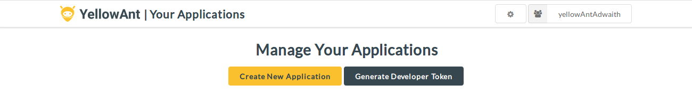
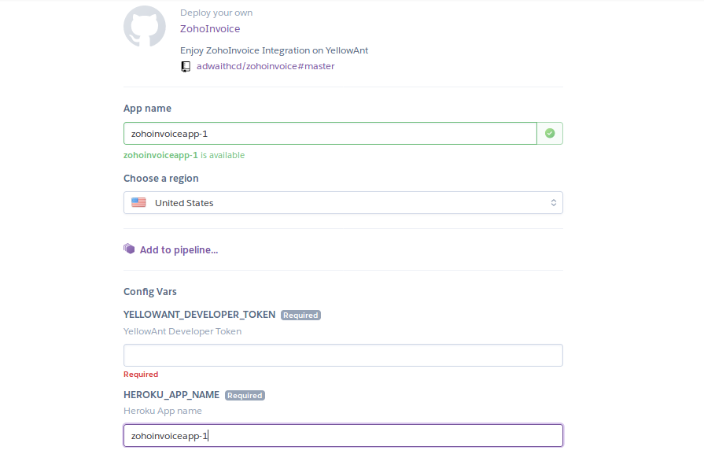

# HEROKU DEPLOYMENT
# ZohoInvoice

Go to YellowAnt developers page and click on Generate Developer Token to get "YA_DEVELOPER_TOKEN"

"HEROKU_APP_NAME" should be same as "App name"

"ZOHO_CLIENT_ID", "ZOHO_CLIENT_SECRET" is to be obtained from Zoho developers account

Change "Authorized redirect URIs" on Zoho developers account to "https://<appname>.herokuapp.com/zoho-redirecturl/"

## DO NOT ALTER - "DISABLE_COLLECTSTATIC" and "ENV"

After deployment click on "View" and change the URL to /admin/. Example: https://<app-name>.herokuapp.com/admin/

Username: admin

Password: pass
  
### We request the user to change the ID AND PASSWORD